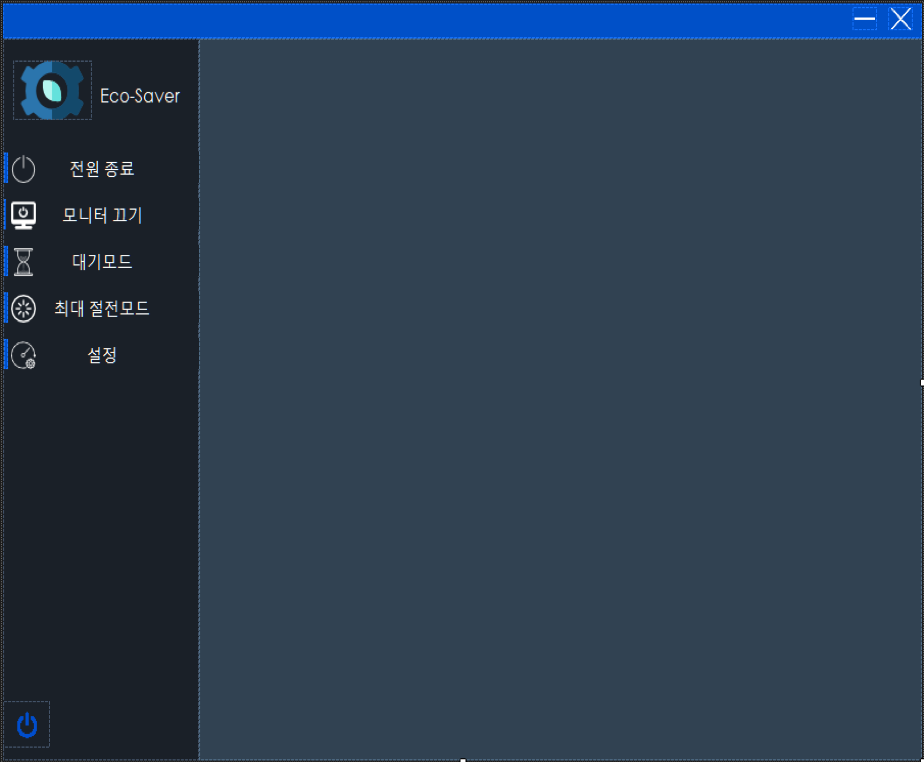
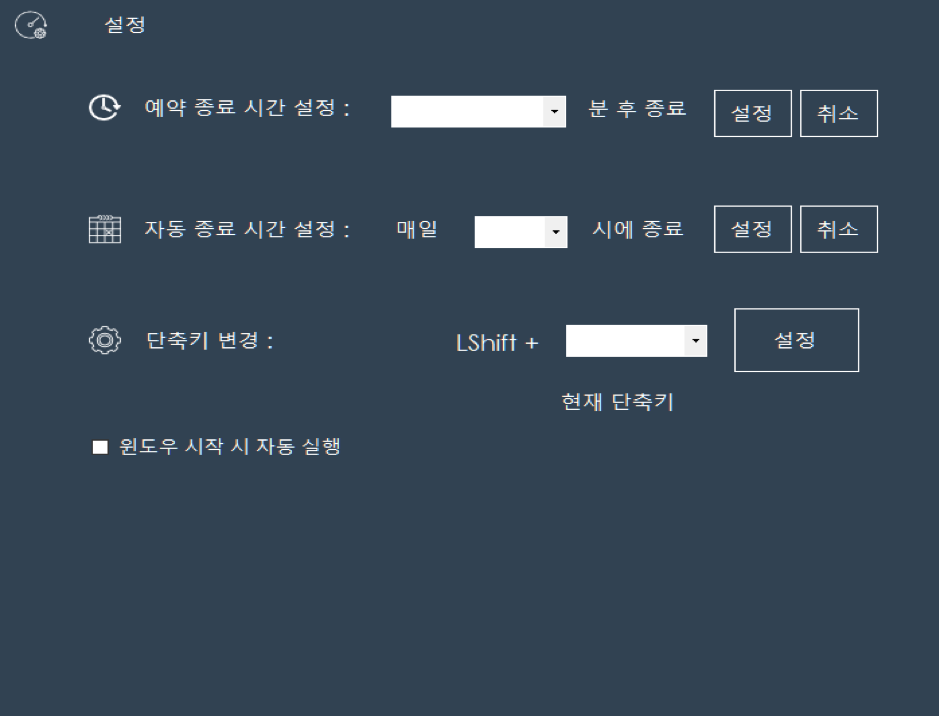
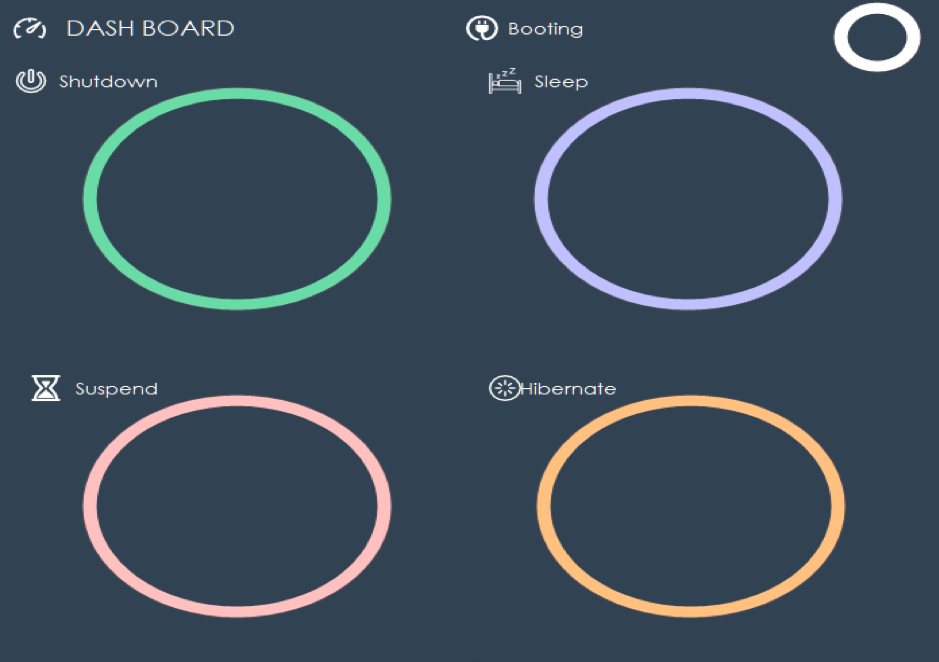
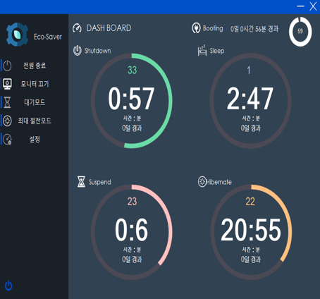
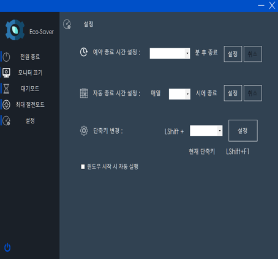

# [Eco-Saver]

## 문제 분석 및 프로그램 설계

* __[요구사항 분석]__
  1. 트레이 아이콘을 이용하여 nircmd의 명령어를 실행할 수 있어야 한다.
  2. 별도의 라이브러리를 이용하여 Keyboard Event Hooking을 구현할 수 있어야 한다.
  3. Keyboard Event Hooking을 통해 nircmd의 명령어를 실행할 수 있어야 한다.
  4. RegistryKey 클래스를 사용하여, 윈도우 시작 시 실행되는 프로세스를 제어할 수 있어야 한다.
  5. 전원 관리 예약 기능을 추가하여, 지정된 시간에 전원 관리 이벤트를 실행할 수 있어야 한다.
  6. 수행된 기능에 대한 로그를 서버에 기록할 수 있어야 한다.
  7. 서버에 기록된 로그를 기반으로 현재 시간을 기준으로 해당 동작이 수행된 후 얼마만큼의 시간이 경과하였는 지 출력할 수 있어야 한다.

* __[프로그램 설계]__
  1. 작업 스케줄러를 이용하여 매일 특정 시간에 시스템이 종료되는 이벤트를 추가한다.
  2. 예약된 작업에 대핵서도 서버에 로그를 기록할 수 있도록 시스템이 종료될 때를 감지하여 서버에 로그를 남기도록 구현한다.
  3. progressBar를 이용하여 이전에 동작이 수행된 시간과 현재 시간과의 차이를 직관적으로 확인할 수 있도록 구현한다.

## 구현 결과

* __[Form1.cs]__

* __[Form2.cs]__

* __[Form3.cs]__

* __[Result]__

